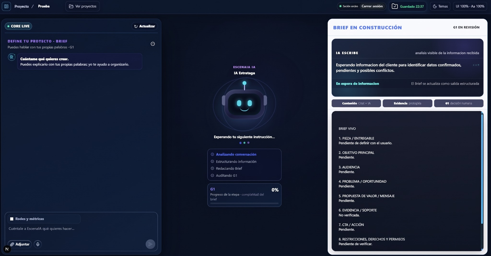
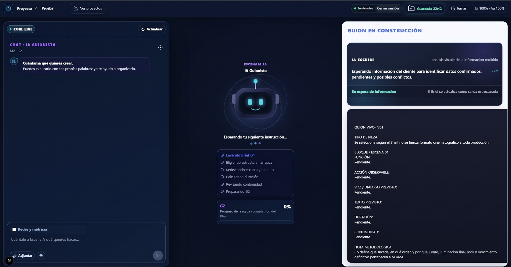
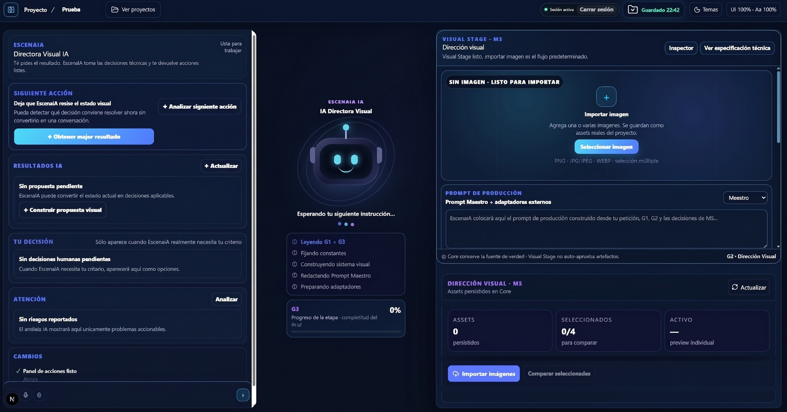
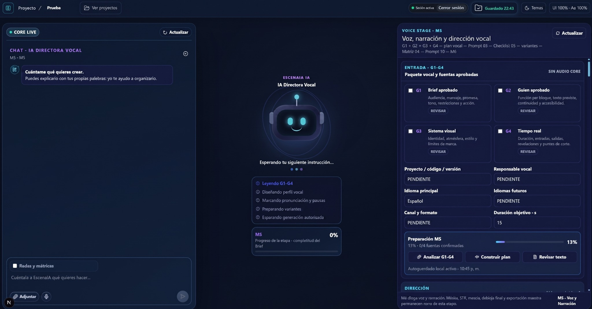
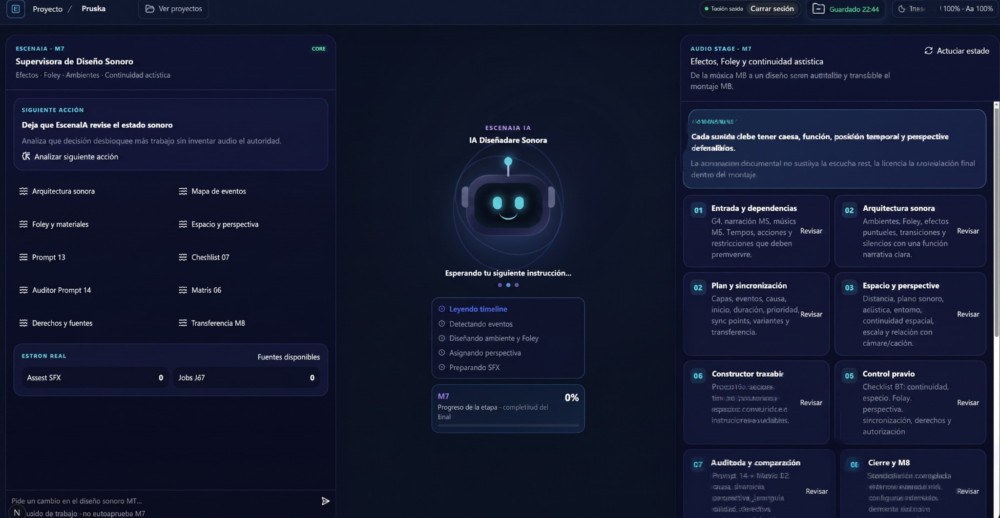

# EscenaIA Studio

**AI-assisted full-stack audiovisual production platform**  
**Status:** Production · Active Development · Commercial Launch in Preparation

EscenaIA Studio is a professional digital product I am building to coordinate audiovisual production workflows with AI, structured project state, human review, automation, and quality assurance.

This repository is a **public portfolio showcase**. It documents the product, architecture, workflows, QA approach, and my role without exposing private source code, credentials, datasets, or proprietary implementation details.

## What the product is designed to do

EscenaIA Studio organizes a production pipeline from strategy to final delivery:

`Brief → Script → Visual Direction → Movement/Video → Voice → Music → SFX → Editing → Text/Accessibility → Color → Adaptations → QC/Delivery`

The Intelligence architecture is designed around:

- **1 central Brain**
- **5 production sectors**
- **12 specialized modules**
- Knowledge Packs
- Worker / Supervisor / Auditor / Gate patterns
- persistent context and project memory
- human-in-the-loop review
- traceability between evidence, suggestions, and approved project state

## Product screenshots

### M1 · Brief / Strategy



**Brief and strategy workspace.** Conversational project intake, AI-assisted analysis and a structured live brief are presented together so the user can move from natural-language input to an auditable production document.

### M2 · Script / Narrative



**Script development workspace.** The module uses the approved brief as context while the AI-assisted workflow organizes narrative structure, scenes, continuity, dialogue and duration into a structured script state.

### M3 · Visual Direction



**Visual direction workspace.** Project context, AI guidance, production prompts, asset import and comparison controls are combined to support traceable visual decisions before downstream generation.

### M5 · Voice / Vocal Direction



**Voice and vocal-direction workspace.** Approved upstream project information is brought together to prepare vocal planning, pronunciation, pacing, variants and later authorized generation.

### M7 · Sound Design / SFX



**Sound-design workspace.** The module organizes sound architecture, events, Foley, ambience, spatial perspective, synchronization, rights and transfer toward the editing stage.

> The screenshots show the product interface in active development. They are portfolio evidence of the workflow and UI; they do not expose the private production codebase.

## My role

**Founder · AI-Assisted Full-Stack Product Builder**

My work includes:

- product definition and functional architecture
- requirements engineering and task decomposition
- AI workflow and agent coordination
- context engineering and structured AI instructions
- frontend/backend integration coordination
- local AI experimentation and integration
- functional QA and acceptance testing
- regression and smoke testing
- backup / rollback workflows
- UX/UI direction
- automation and technical validation
- product iteration based on real runtime behavior

The implementation process is **AI-assisted**. I use AI development workflows to accelerate implementation and technical investigation, while I remain responsible for product decisions, requirements, validation, QA, issue identification, and iterative correction.

## Technology areas

### Practical experience

- Next.js
- React
- TypeScript
- Node.js
- Fastify
- PostgreSQL
- PowerShell
- FFmpeg / FFprobe
- Ollama / Qwen

### Product & AI concepts

- AI-assisted software development
- AI product integration
- agent orchestration
- context engineering
- prompt / instruction engineering
- human-in-the-loop workflows
- structured outputs
- provenance and traceability
- local-first AI
- QA and product validation

## QA / Quality Assurance

A major part of this project is validating that features work in practice, not only that code compiles.

My QA workflow includes:

- functional tests
- targeted regression tests
- smoke tests
- typecheck / build validation
- runtime validation
- frontend behavior review
- backup before risky changes
- rollback when a version fails
- human acceptance testing

## Product architecture — high level

```text
User
  ↓
EscenaIA Studio UI
  ↓
Core / Project State
  ↓
Central Brain
  ↓
Active Module + Knowledge
  ↓
Worker → Supervisor → Auditor → Gate
  ↓
Structured project state
  ↓
Next production stage
```

The public diagram is intentionally simplified. Private implementation details, credentials, internal prompts, provider secrets, and proprietary data are not published here.

## Technical code samples

A small set of **sanitized, runnable samples derived from the private codebase** is available in [`demo-code/`](demo-code/).

They demonstrate:

- AI authority boundaries
- fail-closed structured-output sanitization
- proposal-first human review
- immutable-version conflict protection
- signed authentication transaction state
- runnable Node.js QA tests

The complete production repository remains private.

## Current development focus

- strengthening conversational AI behavior
- completing specialized module coordination
- improving observability and evaluation
- production hardening
- improving UX and accessibility
- preparing public commercial launch

## About me

**Jheremi Kelbin Miranda Camacho**  
Cochabamba, Bolivia · Remote

- GitHub: https://github.com/JHEREMI2005
- LinkedIn: https://www.linkedin.com/in/jheremi-kelbin-miranda-camacho-3137a424b/

---

## Resumen en español

EscenaIA Studio es una plataforma Full-Stack audiovisual asistida por IA que utilizo como producto real en desarrollo activo para fortalecer y demostrar habilidades de integración de IA, coordinación técnica, automatización, QA, producto y arquitectura de software.

El código privado, secretos, credenciales y componentes propietarios no forman parte de este repositorio público. En `demo-code/` se muestran únicamente ejemplos técnicos reducidos y sanitizados.
